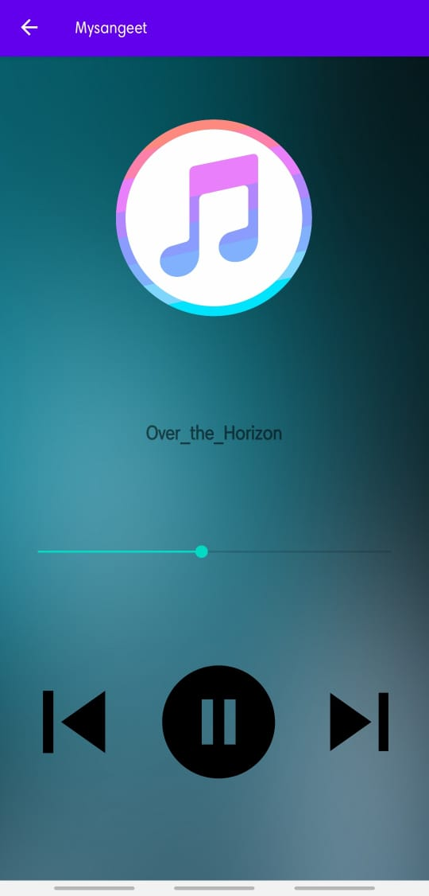

# Mysangeet

## Table of contents

* [Introduction](#introduction)

* [Features](#features)

* [Demo Screenshots](#demo-screenshots)

* [Requirements](#requirements)

* [Installation](#installation)

* [Usage](#usage)

* [Contributing](#contributing)

## Introduction

Mysangeet is a simple and user-friendly music player application for Android devices. This app is built using Dexter, Java, and Android Studio. It allows users to browse and play their favorite songs on their mobile devices with ease.

## Features

Browse and play music files stored on the device.
Repeat and shuffle songs.
View and edit music metadata.
Play songs in the background while using other apps.

## Demo Screenshots

 

 
 

 

## Requirements

Android 5.0 (Lollipop) or later.

## Installation

To install Mysangeet on your Android device, download the APK file from the releases page and follow the on-screen instructions.

## Usage

After installing Mysangeet, launch the app to access the main screen. From here, you can browse your music library, create and manage playlists, and customize playback settings.

## Contributing

If you would like to contribute to the development of Mysangeet, please submit a pull request or open an issue on the GitHub repository.
